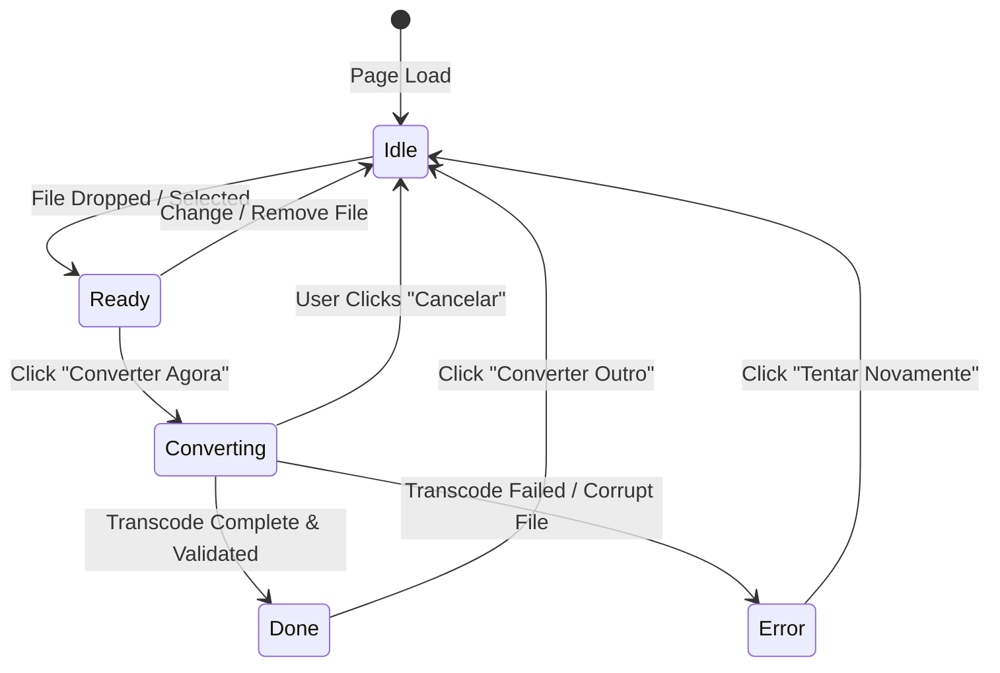

# Codebase Architecture — conversordevideo.com

This document describes the architectural design, layer boundaries, data flow, and subsystems of **conversordevideo.com**.

---

## 🏛️ 1. Architectural Overview & System Design

```
+-------------------------------------------------------------------------------+
|                             Static Shell (Astro SSG)                          |
|  - HTML Pre-rendering (TTFB < 50ms)     - Responsive Header & Footer          |
|  - Metadata & Open Graph Tags           - JSON-LD Structured Data Schema      |
|  - Semantic Portuguese SEO Articles     - FAQ Accordions & How-To Guides      |
+-------------------------------------------------------------------------------+
                                      |
                                      | client:idle hydration
                                      v
+-------------------------------------------------------------------------------+
|                       Interactive Island (React 19)                           |
|  [FileDropZone] ---> [Metadata Inspector] ---> [Format & Preset Selector]    |
|                               |                                               |
|                               v                                               |
|                    [ConversionProgress & Cancel]                              |
|                               |                                               |
|                               v                                               |
|                    [ResultCard: Download & Embed]                             |
+-------------------------------------------------------------------------------+
                                      |
                                      | WebAssembly API Calls
                                      v
+-------------------------------------------------------------------------------+
|                 Client-Side Transcode Engine (FFmpeg.wasm)                    |
|  - In-Memory Virtual File System (MEMFS) - H.264 / AAC / LAME / WebM Codecs   |
|  - Single / Multi-Thread Web Worker      - Zero External Network Requests     |
+-------------------------------------------------------------------------------+
```

---

## 🧩 2. Core Subsystems & Layer Separation

### A. Deep Domain Store (`src/data/formatPages.ts`)
Instead of duplicating page layouts and SEO boilerplate across multiple `.astro` files, all route-specific configuration is centralized in a typed data structure:
- **Interface:** `FormatPageData`
- **Responsibilities:**
  - Route slug and keyword mappings
  - Primary H1 copy and descriptive headings
  - Unique technical explainer copy (why MOV to MP4, why WebM, etc.)
  - Side-by-side format comparison bullet points
  - Unique FAQ questions and answers for Google `FAQPage` rich snippets

### B. Deep Layout Component (`src/layouts/ConverterPageLayout.astro`)
Consumes `FormatPageData` to generate a standardized, accessible, and SEO-optimized page:
- Injects `WebApplication`, `HowTo`, `FAQPage`, and `BreadcrumbList` JSON-LD schemas.
- Configures `ConverterApp` with appropriate `initialTargetFormat` and `initialPreset`.
- Renders the responsive comparison grid and structured content.

### C. WebAssembly Transcoding Engine (`src/lib/ffmpeg/engine.ts`)
The `FFmpegEngine` singleton encapsulates all interaction with `@ffmpeg/ffmpeg`:
1. **Dynamic Initialization:** Loads the ~31MB WASM binary only when the user selects a file or triggers an action, preserving initial page load speed.
2. **Multi-Thread / Single-Thread Fallback:** Detects `window.SharedArrayBuffer`. If available (via COOP/COEP headers), loads `@ffmpeg/core-mt` for multi-threaded processing; otherwise falls back gracefully to `@ffmpeg/core`.
3. **Memory Reclamation:** Virtual files (`writeFile`) are explicitly deleted (`deleteFile`) after reading output blobs, preventing browser tab crashes from memory leaks.
4. **Cancellation Hook:** Exposes `cancel()`, terminating active tasks cleanly on user request.
5. **Output Validation:** Checks buffer sizes and decodability before transitioning to the completed state.

### D. Client-Side Metadata & Poster Inspector (`src/lib/ffmpeg/metadata.ts`)
Uses an off-screen HTML5 `<video>` element and `<canvas>` to inspect media properties without sending data to servers:
- **Duration:** Formatted as `MM:SS` or `HH:MM:SS`.
- **Resolution:** e.g., `1920×1080` (1080p), `3840×2160` (4K).
- **Poster Frame:** Captures a sharp snapshot at `1.0s` and outputs a JPEG blob ready for download or `<video poster="...">` embedding.

### E. WhatsApp Target Bitrate Algorithm (`src/lib/ffmpeg/presets.ts`)
Calculates the exact video bitrate required to fit within WhatsApp's 16MB file limit based on duration:
$$\text{targetKB} = 14.5 \times 1024 = 14848 \text{ KB}$$
$$\text{totalBitrateKbps} = \left\lfloor \frac{\text{targetKB} \times 8}{\text{durationSeconds}} \right\rfloor$$
$$\text{videoBitrateKbps} = \max(150, \min(2500, \text{totalBitrateKbps} - 96))$$

---

## 🔄 3. Interactive Converter State Machine



---

## 🔒 4. Security & Privacy Architecture

1. **Air-Gapped Processing:** Zero HTTP `POST` requests are made with video data. All processing occurs in the browser sandbox.
2. **COOP/COEP Isolation:** Configured in `public/_headers` to unlock high-performance multi-threading:
   - `Cross-Origin-Opener-Policy: same-origin`
   - `Cross-Origin-Embedder-Policy: require-corp`
3. **LGPD Architecture:** Because no user data is collected, stored, or transmitted, compliance with Brazilian Law 13.709/2018 is guaranteed by architecture rather than policy alone.

---

## 📱 5. PWA & Offline Caching Architecture

- **Manifest:** `public/manifest.json` provides standalone installation capability on Android, iOS, and desktop browsers.
- **Service Worker:** `public/sw.js` caches static application assets (`/`, `/converter-mov-para-mp4`, `/converter-video-para-mp3`, `/video-para-gif`, `/comprimir-video`, `favicon.svg`) enabling offline conversion.
